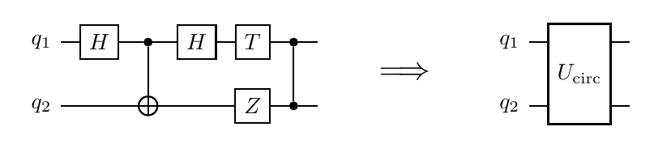

# Stretto.jl

<div align="center">
  <table>
    <tr>
      <td align="center">
        <b>Documentation</b>
        <br>
        <a href="https://docs.harmoniqs.co/Stretto/stable/">
          
        </a>
        <a href="https://docs.harmoniqs.co/Stretto/dev/">
          
        </a>
      </td>
      <td align="center">
        <b>Build Status</b>
        <br>
        <a href="https://github.com/harmoniqs/Stretto.jl/actions/workflows/CI.yml?query=branch%3Amain">
          
        </a>
        <a href="https://codecov.io/gh/harmoniqs/Stretto.jl">
          
        </a>
      </td>
      <td align="center">
        <b>License</b>
        <br>
        <a href="https://opensource.org/licenses/MIT">
          
        </a>
      </td>
    </tr>
  </table>
</div>

> **A circuit isn't a sequence of gates. It's a unitary. Compile it as one.**

<p align="center">
  
</p>

**Stretto.jl** is the circuit-to-pulse compilation layer of the [Piccolo.jl](https://github.com/harmoniqs/Piccolo.jl) ecosystem. Given a gate-level circuit and a hardware device profile, Stretto synthesizes a single optimized control pulse that implements the whole circuit as one block unitary $U$ — skipping gate decomposition, scheduling, and gate-boundary error accumulation.

## Why this is different

A conventional quantum compiler decomposes a circuit into native gates, schedules them, and lowers each gate to a precomputed pulse. That pipeline leaves pulse-level fidelity on the table — every gate boundary is a re-initialization, every idle qubit is accumulating decoherence, every decomposition hides joint optimization opportunities.

Stretto treats the circuit as a unitary $U_\text{circ}$ and solves directly for a control pulse $u(t)$ on the device system $H_\text{sys}(u)$:

```math
\begin{aligned}
\min_{u(t),\,\varphi}\quad & 1 - \mathcal{F}\!\left(U_\text{circ},\, V_\varphi\, U(T;\,u)\right) \\
\text{subject to}\quad & \dot{U}(t) = -i\,H_\text{sys}(u(t))\,U(t),\quad U(0) = I, \\
 & u_\text{min} \le u(t) \le u_\text{max}.
\end{aligned}
```

$V_\varphi$ are per-qubit virtual-Z phases (free-phase). $\mathcal{F}$ is the Pedersen subspace fidelity on the computational levels.

| | Conventional | Stretto |
|---|---|---|
| Optimization unit | one gate | one block (or whole circuit) |
| Gate-boundary error | $N$ × per-gate error | one solve, no boundaries |
| Idle decoherence | every non-active qubit at every layer | actively driven through the block |
| Hardware coupling | hidden in decomposition | first-class — pulse uses the device's actual drift |
| Duration | $\sum$ gate durations + scheduling slack | min-time compressed against fidelity floor |

## Quick example

Cold-start a single-qubit `X` gate on a 2-level model of an IBM Heron r3 transmon:

```julia
using Random, Stretto
Random.seed!(0xc0ffee)

device = HeronR3(n_levels = 2)         # qubit subspace; drop the kwarg for 3-level (with leakage)
circuit = GateCircuit([GateOp(:X, (1,))], 1)

report = compile(
    circuit, device;
    max_iter = 1500, T_ns = 60.0, N_knots = 21,
    Q = 100.0, R = 1e-4, ddu_bound = 10.0,
    free_phase = true,
)
```

```
Pulse fidelity  : 0.99283
Pulse duration  : 60.0 ns
Wall clock      : ~120 s on a workstation
```

The full runnable script is at [`scripts/x_heronr3_2level.jl`](scripts/x_heronr3_2level.jl).

> **For multi-qubit circuits or high-fidelity (≥ 5-nines) results,** the substrate cold-start path isn't enough — install [Strettissimo](#whats-where) to enable parallel multistart, catalog warm-starts, and min-time compression. Public Stretto lands you in the right basin; Strettissimo lands you at the bottom.

## Compiling QEC blocks

The flagship use case: compile each block of a multi-block QEC circuit (e.g. surface-code syndrome extraction) once into a reusable pulse. Subsequent rounds reuse the cached pulse instead of re-decomposing.

```julia
report = compile(syndrome_circuit, device; strategy = :warm_stitch_transmon)
```

`:warm_stitch_transmon` (in [Strettissimo](#whats-where), Harmoniqs' private competitive layer) does the full pipeline:

1. **Transpile** to native gates: `to_native(circuit, device)` — pure circuit rewriting, e.g. `CNOT(c,t) → H(t)·CZ(c,t)·H(t)`.
2. **Schedule** the native gates serially (or with parallelization in v0.4+).
3. **Stitch** catalog pulses into a single warm-start pulse for the whole block.
4. **Joint-solve** the block as one optimization — eliminates gate-boundary errors, exploits the device drift.
5. **Min-time compress** against a fidelity floor.

## What's where

Stretto is a substrate that runs *productively on small problems* with no proprietary dependencies. Harmoniqs' competitive compilation intelligence lives in a private overlay package, **Strettissimo.jl**, which plugs in via Stretto's strategy-registry seam:

| Feature | Stretto (public, MIT) | Strettissimo (private) |
|---|---|---|
| Circuit IR (`GateCircuit`, `GateOp`, `circuit_unitary`) | ✅ | — |
| Gate library (`qft`, `toffoli`, `ccz`, ...) | ✅ | — |
| Device profiles (`HeronR3`, `Willow`, `Ankaa3`, ...) | ✅ | — |
| `to_native` transpile pass | ✅ | — |
| `compile_block` substrate pipeline | ✅ | — |
| `BilinearIntegrator` (cold-start, 1-2Q) | ✅ substrate | — |
| `SplineIntegrator` (multi-qubit scaling) | — | ✅ |
| Pulse catalog warm-starts | — | ✅ |
| Graph-based partitioning | — | ✅ |
| Parallel multistart solver | — | ✅ |
| QEC kernel compilation | thin entry point | ✅ implementation |
| Stagnation / landscape diagnostics | — | ✅ |

Stretto users get a working substrate. Harmoniqs collaborators and NDA partners get the competitive layer.

## Installation

```julia
using Pkg
Pkg.add("Stretto")
```

For multi-qubit problems Stretto's default `BilinearIntegrator` can exhaust memory during evaluator construction. Harmoniqs collaborators with access to `Piccolissimo.jl` can swap in a scalable spline-based integrator by loading Strettissimo, which auto-installs the override on `__init__`.

## Status

| Version | What ships |
|---|---|
| v0.2 | Circuit IR, device profiles, `compile_block`, four substrate seams |
| v0.3 | `CompilationStrategy` registry, `select_strategy`, `:default` strategy |
| **v0.4** | **`to_native(circuit, device)` transpile pass** |
| v0.5 (planned) | QASM import |
| v0.6+ | Framework adapters (Qiskit / Cirq via PythonCall) |

## Contributing

```bash
# Run substrate tests (no private deps)
julia --project=. test/runtests.jl

# Run with Piccolissimo for multi-qubit smoke tests
julia --project=. -e 'using Pkg; Pkg.develop(path="../Piccolissimo.jl")'
STRETTO_FULL_TESTS=1 julia --project=. test/runtests.jl

# Build docs
./docs/get_docs_utils.sh
julia --project=docs docs/make.jl
```

## See also

- [Piccolo.jl](https://github.com/harmoniqs/Piccolo.jl) — the quantum optimal control engine Stretto sits on top of.
- [spec-20260418-stretto-strettissimo-split](amico/vault/specs/spec-20260418-stretto-strettissimo-split.md) — design doc for the public/private split and seam contract.
- [spec-20260413-qec-pulse-kernels](amico/vault/specs/spec-20260413-qec-pulse-kernels.md) — the flagship QEC-kernel compilation application.

---

*"Some people stretto. Some people wait."*
